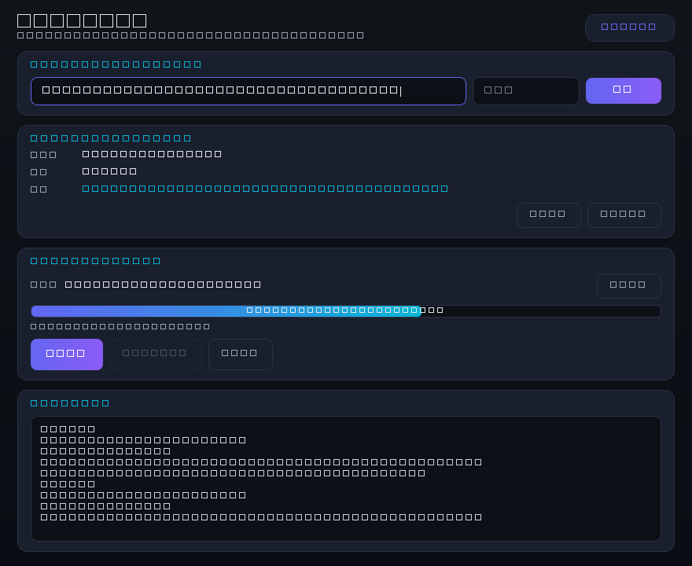

# lanzou-direct-link

> 把蓝奏云（Lanzou）的分享链接解析成**可以直接丢进浏览器的下载直链** —— 带图形界面，粘贴链接即自动解析并下载。
> Turn a Lanzou Cloud share link into a **direct download URL** — with a GUI: paste a link, it auto-parses and downloads.

[](#-安装--installation)
[](LICENSE)
[](#-安装--installation)
[](https://pypi.org/project/PyQt6/)

<p align="center">
  
</p>

---

## 📖 目录 / Table of Contents

- [这是什么 / What is this](#-这是什么--what-is-this)
- [特性 / Features](#-特性--features)
- [安装 / Installation](#-安装--installation)
- [快速开始 / Quick Start](#-快速开始--quick-start)
- [原理详解 / How It Works](#-原理详解--how-it-works)
- [API 参考 / API Reference](#-api-参考--api-reference)
- [打包成 exe / Build a Standalone EXE](#-打包成-exe--build-a-standalone-exe)
- [常见问题 / FAQ](#-常见问题--faq)
- [注意事项与免责声明 / Disclaimer](#-注意事项与免责声明--disclaimer)
- [License](#-license)

---

## 🧩 这是什么 / What is this

**中文**

蓝奏云的分享页（`https://xxx.lanzou?.com/abcdef`）**本身不是下载地址**。
真正的直链要靠页面里的一个 `sign` 令牌，向 `ajaxm.php` 换一次才拿得到 ——
这也是为什么你没法直接把分享链接喂给 IDM / aria2 / 浏览器下载。

> **⚠️ 2026 现状（很重要）**
> 蓝奏云现在给分享页加了一层 **JS 反爬挑战**：`requests` 拿到的不是页面，而是
> 4KB 左右的 `<script>var arg1='B47A77C7...'`，里面**没有 iframe、没有 sign、
> 没有 ajaxm.php**，纯 HTTP 的路子必然失败。
> 更麻烦的是：**下载节点（`*.lanrar.com` 这类）自己也挂了一层同样的挑战**，
> 所以就算你拿到了直链，`requests.get(直链)` 拿回来的仍然是挑战页而不是文件。
>
> 本库因此把 **真实浏览器渲染** 作为主路径，并且会顺手把**下载节点那层反爬**
> 也过一次、把 cookie 留下来给 `requests` 用 —— 于是你依然能拿到一个
> 「粘进 IDM / 浏览器就能用」的直链，也能用本工具带进度条下载。

**English**

A Lanzou share page (`https://xxx.lanzou?.com/abcdef`) is **not** a download URL.
The real link is obtained by exchanging an in-page `sign` token against `ajaxm.php`
— which is why you cannot hand a share link straight to IDM, aria2 or your browser.

> **⚠️ State of play (2026)**
> Lanzou now front-loads the share page with a **JavaScript anti-bot challenge**:
> plain `requests` gets ~4 KB of `<script>var arg1='B47A77C7...'` containing
> **no iframe, no sign and no `ajaxm.php`**, so the pure-HTTP route cannot work.
> Worse, the **download node itself** (`*.lanrar.com` and friends) is behind the
> same challenge, so even with a direct URL in hand `requests.get()` returns the
> challenge page instead of your file.
>
> This project therefore treats **real-browser rendering** as the primary path,
> and additionally clears the challenge on the **download node**, keeping the
> resulting cookie for `requests` — so you still end up with a direct URL you can
> paste into IDM/a browser, and a downloader with a live progress bar.

- **Input**: a Lanzou share link (+ optional extraction code)
- **Output**: a **direct URL** like `https://developer4.lanrar.com/file/?...` that you can
  paste into a browser, feed to IDM / aria2 / curl, or download with the bundled CLI

---

## ✨ 特性 / Features

- **🖥️ 图形界面：粘贴即解析**
  `lanzou_gui.py` —— 粘链接进输入框就自动开始解析，回车也行；启动时还会自动读剪贴板。
  界面里直链一键复制 / 一键用浏览器打开，内置下载器带实时进度与速度。
  **GUI: paste and it just works** — auto-parses on paste (and reads your clipboard
  at startup), one-click copy / open, plus a built-in downloader with live progress.
- **纯 `requests` 内核，只依赖一个库**
  核心库 `lanzou_direct.py` 只依赖 `requests`；PyQt6 只为界面而装。
  （浏览器引擎 `lanzou_browser.py` 需要 playwright —— 见下条。）
  Pure `requests` core — `lanzou_direct.py` needs nothing but `requests`
  (the browser engine in `lanzou_browser.py` additionally needs playwright).
- **🌐 真实浏览器引擎（默认路径）**
  现代蓝奏云必须执行 JS 才出直链，所以本库会驱动一个**无头真浏览器**渲染分享页，
  按 28 种方法依次尝试提取直链；内核优先复用系统 Edge / Chrome，不必额外下内核。
  **Real-browser engine** — renders the share page in a headless browser and tries
  28 extraction strategies in order, reusing your system Edge/Chrome.
- **🛡️ 自动过下载节点的 CDN 反爬**
  直链所在节点会返回 JS 挑战页；本库借同一个浏览器把挑战过一次，拿到
  `acw_sc__v2` 等 cookie 交给 `requests`，于是**下载和进度条都还是纯 HTTP 的**，
  顺便还从 `Content-Disposition` 里读出了**真实文件名和大小**
  （原脚本这步缺失，只能下到 4KB 的挑战页，真文件名也被兜底成假名）。
  **Clears the CDN anti-bot challenge on the download node** and reuses its cookie
  with `requests`, so downloading stays plain HTTP *and* the real filename/size
  come from `Content-Disposition`.
- **不依赖任何第三方解析服务**
  不调用别人的 API，不受第三方限流/下线影响，也不会把你的链接送到别人服务器上。
  No third-party parsing API: no rate limits, no downtime, and your links never
  leave your machine.
- **自适应蓝奏云的多轮前端改版**
  `sign` / `signs` / `ves` / ajax 端点都排了多组正则，域名支持 `lanzou*` / `lanzo*` / `lanzn` 全系列镜像。
  Multiple regex patterns for `sign` / `signs` / `ves` / ajax endpoints, and
  support for the whole `lanzou*` / `lanzo*` / `lanzn` mirror family.
- **自动进 `iframe`**
  蓝奏云常把正文放在 iframe 里，本库会自动跟进去再提取。
  Automatically descends into the content `iframe`.
- **支持提取码**
  传入 `pwd` 会随请求一起提交，并能区分「真的解析失败」和「需要提取码」。
  Password-protected shares are supported, and "needs a code" is a distinct error.
- **下载自动带 Referer**
  蓝奏云 CDN 会校验 `Referer`，直接拿直链下载可能 403；本库的下载器会自动带上正确请求头。
  The downloader always sends the Referer Lanzou's CDN expects.
- **可取消的下载**
  取消后会自动删掉半截文件，不留垃圾。
  Cancelling cleans up the partial file.
- **可选的最终地址解析**
  `resolve=True` 再跟一层重定向，拿到带真实文件名的 CDN 地址。
  `resolve=True` follows redirects to the final CDN URL with the real filename.
- **两层测试**
  54 个离线单元测试（含 mock 端到端、CDN 反爬、文件名推断）+ 46 项无头 GUI 功能测试
  （自建本地假 CDN 验证下载/取消）。
  54 offline unit tests (mock end-to-end, CDN challenge, filename handling) +
  46 headless GUI checks (download/cancel verified against a local fake CDN).

---

## 🚀 安装 / Installation

**中文**

```bash
git clone https://github.com/CCWP123/lanzou-direct-link.git
cd lanzou-direct-link

pip install -r requirements.txt      # requests + PyQt6 + playwright

# playwright 是解析现代蓝奏云的必要依赖（分享页必须执行 JS 才出直链）：
playwright install chromium          # 系统已有 Edge/Chrome 的话可以跳过这步

# 跑测试
python tests/test_extract.py         # 54 个离线单元测试
python tests/gui_functional.py    # 46 项无头 GUI 功能测试（需 PyQt6，不需要显示器）
```

**English**

```bash
git clone https://github.com/CCWP123/lanzou-direct-link.git
cd lanzou-direct-link

pip install -r requirements.txt      # requests + PyQt6 + playwright

# playwright is required for modern Lanzou (the share page needs JS to run):
playwright install chromium          # skip if you already have Edge/Chrome

python tests/test_extract.py         # 54 offline unit tests
python tests/gui_functional.py    # 46 headless GUI checks (needs PyQt6, no display)
```

---

## ⚡ 快速开始 / Quick Start

### 🖥️ 图形界面 / GUI（推荐给普通用户）

```bash
python lanzou_gui.py
```

用法就三步：

1. **把蓝奏云分享链接粘进输入框** —— 粘上就自动开始解析（也可以按回车或点「解析」）；
   程序启动时如果发现剪贴板里已经有蓝奏云链接，也会自动填进去并解析。
2. 有提取码就填在右边的「提取码」框里。
3. 解析出文件名/大小/直链后，点 **「开始下载」** 即可；也可以点 **「复制直链」** 拿去喂给
   IDM / aria2，或点 **「浏览器打开」** 直接跳转。

下载过程中有实时进度和速度，随时可以点「取消下载」（会顺手删掉半截文件）。

### 命令行 / CLI

```bash
# 最常用：解析并打印直链
python cli.py "https://www.lanzou.com/xxxxx"

# 带提取码
python cli.py "https://www.lanzou.com/xxxxx" --pwd 1234

# 只要直链本身（方便脚本/管道）
python cli.py "https://www.lanzou.com/xxxxx" --quiet
URL=$(python cli.py "https://www.lanzou.com/xxxxx" --quiet)

# 直接丢进默认浏览器
python cli.py "https://www.lanzou.com/xxxxx" --open

# 用本工具下载到当前目录
python cli.py "https://www.lanzou.com/xxxxx" --download .

# 再跟一层重定向，拿最终 CDN 地址
python cli.py "https://www.lanzou.com/xxxxx" --resolve

# 强制指定引擎：默认 auto（先 HTTP 快路，失败自动切浏览器）
python cli.py "https://www.lanzou.com/xxxxx" --browser   # 直接用浏览器，最稳
python cli.py "https://www.lanzou.com/xxxxx" --http      # 只走纯 HTTP，最快但常失败

# 结构化输出
python cli.py "https://www.lanzou.com/xxxxx" --json
```

输出示例 / sample output:

```
──────────────────────────────────────────────────────────────
文件名 / name   : 示例文件.zip
大小   / size   : 12.3 M
分享页 / share  : https://www.lanzou.com/xxxxx
──────────────────────────────────────────────────────────────
直链 / direct URL:
  https://vip.lanzou.com/file/i9abc123
──────────────────────────────────────────────────────────────
提示：直接把这个地址粘贴进浏览器即可下载；
      若浏览器提示 403，说明该 CDN 需要 Referer —— 改用 --download。
```

`--json` 输出 / JSON output:

```json
{
  "direct_url": "https://vip.lanzou.com/file/i9abc123",
  "middle_url": "https://vip.lanzou.com/file/i9abc123",
  "name": "示例文件.zip",
  "size": "12.3 M",
  "share_url": "https://www.lanzou.com/xxxxx",
  "real_url": "",
  "raw": {"zt": 1, "dom": "https://vip.lanzou.com", "url": "i9abc123"}
}
```

### 作为库使用 / As a library

```python
from lanzou_direct import parse

f = parse('https://www.lanzou.com/xxxxx')          # 或 pwd='1234'
print(f.name)          # 示例文件.zip
print(f.size)          # 12.3 M
print(f.direct_url)    # https://vip.lanzou.com/file/i9abc123

# 再跟一层重定向
f = parse('https://www.lanzou.com/xxxxx', resolve=True)
print(f.real_url)
```

---

## 🔬 原理详解 / How It Works

### 现在的主路径：浏览器渲染 / The primary path: render it

```
① Playwright 起一个无头浏览器（复用系统 Edge → Chrome → 自带 Chromium）
② 打开分享页，等 JS 跑完，读渲染后的 HTML
③ 从中找正文 iframe（正则 + DOM 查询双保险）
④ 进入 iframe，按 28 种方法依次尝试拿直链
      方法 3「浏览器静默提取」最常用：直接读 DOM 上的
      document.querySelector('a[href*="/file/?"]')
⑤ 拿到直链 → 顺手过下载节点的 CDN 反爬（见下节）
```

对应的关键代码 / the corresponding code:

```python
from lanzou_browser import parse_local

r = parse_local(share_url, pwd)      # ②③④
direct = r['data']['downloadurl']    # ⑤
```

28 种方法的顺序与来源脚本 `蓝奏云网盘.py` 完全一致，没有删减；
唯一的优化是**整个解析过程只启动一次浏览器**（原脚本 16 个浏览器方法各自
`sync_playwright()` + `launch()`，一次解析要 20~40 秒，现在通常 3~8 秒）。

### 下载节点的 JS 反爬 / The download node's anti-bot challenge

这是最容易踩的坑：**拿到直链不等于能下载**。

```
GET https://developer4.lanrar.com/file/?UzUFOwo7AzID...
→ 200 OK, Content-Type: text/html, 4321 字节
   <html><script>var arg1='6A8408035F417F52C0708BC196A0B23D32AF...'
```

这段 JS 要在**真实浏览器里执行**，算出一个值写进 `acw_sc__v2` cookie 并自我
reload，CDN 才肯把真文件吐出来。所以本库的做法是：

```
① requests HEAD 直链          → 拿到 text/html / X-Tengine-Error → 判定是挑战页
② 借同一个浏览器打开直链        → 只等 cookie，不等页面加载完
                                （wait_until='commit'，且 accept_downloads=False，
                                  免得白白下几十 MB）
③ 抓出 cookie：acw_sc__v2 / acw_tc / cdn_sec_tc / down_ip
④ requests HEAD 直链（带 cookie）
   → Content-Disposition: attachment; filename*=UTF-8''%E8%B6%85...
   → Content-Length: 30127389  ·  Accept-Ranges: bytes
⑤ 于是真文件名、真大小、可续传全都到手；下载仍然是纯 HTTP + 进度条
```

实测同一条链接：`超英汉化技能图生4.37.exe`，28.73 MB，约 21 MB/s。

> The JS writes `acw_sc__v2` and reloads; the CDN only serves the file afterwards.
> We open the direct link in the *same* browser just long enough to harvest that
> cookie, then hand it to `requests`. Real filename and size come from
> `Content-Disposition` / `Content-Length`.

### 老路子：七步换直链（现在多数会失败，保留作兜底）

```
① GET   分享页                      → HTML（跟随重定向，记下最终 URL 作为 Referer）
② GET   <iframe src>（如果有）      → 蓝奏云常把正文塞在 iframe 里，要跟进去
③ 从 HTML 里提取：
        sign       形如  var sign = 'xxxx'         ← 最关键，没有它就换不出直链
        signs      部分页面才有
        ves        版本号，默认 "1"
        ajax 路径  默认 /ajaxm.php
        fid        文件数字 ID（老接口要拼在 ?file= 后面）
④ POST  <ajax>?file=<fid>
         action=downprocess & sign=<sign> & ves=<ves> [& signs=<signs>] [& p=<提取码>]
⑤ 返回 JSON：
         {"zt":1, "dom":"https://vip.lanzou.com", "url":"i9abc123",
          "inf":"示例文件.zip", "size":"12.3 M"}
⑥ 拼直链： direct = dom + "/file/" + url
⑦ 可选：跟随重定向 → 最终带文件名的 CDN 地址
```

对应的关键代码 / the corresponding code:

```python
sign = extract_sign(html)                       # ③
out  = _exchange_direct_url(sess, base, referer, # ④⑤
                            sign=sign, ves=extract_ves(html),
                            fid=extract_fid(html), pwd=pwd,
                            ajax_path=extract_ajax_path(html))
direct = out['direct_url']                      # ⑥  dom + "/file/" + url
real   = resolve_real_url(direct)               # ⑦
```

用 `engine='http'`（CLI 的 `--http`）可以强制只走这条路 —— 快，但遇到挑战页会
**提前识别并退出**（`looks_js_challenge`），不会浪费几次无用请求。

### 为什么直链粘进浏览器有时 403 / Why the browser sometimes 403s

蓝奏云的 `dom/file/xxx` 是**中间页**，它的 CDN 会校验 `Referer`。
浏览器直接打开时没有正确的 Referer，所以可能 403。
三种解法：

1. 用 `--resolve` 拿到跟随重定向后的**最终 CDN 地址**（通常可以直接下载）
2. 用 `--download` 让本工具带正确的 Referer 帮你下
3. 直接把这个直链喂给 IDM / aria2 这类能自定义请求头的下载器

> Lanzou's `dom/file/xxx` is an intermediate page whose CDN checks `Referer`.
> Use `--resolve` for the final CDN URL, `--download` to let this tool send the
> right headers, or feed the link to a downloader that supports custom headers.

### 关于 `ves` 的贪婪匹配坑 / The greedy `ves` gotcha

很多老脚本（包括本项目的来源脚本）用这个正则取版本号：

```python
re.search(r"var\s+ves\s*=\s*['\"]?([^'\"]+)['\"]?", html)
```

`[^'"]+` 是「除了引号什么都吃」的贪婪匹配。遇到 `var ves = 2;` 这种**没有结尾引号**的写法，
它会把后面整段 JS 都吞进去，导致 `ves` 变成一个巨大的字符串，`ajaxm.php` 直接拒绝。

本项目改成了 `[\w.\-]+` 并在测试里锁死了这个回归：

```
tests/test_extract.py::TestExtractSignsVesFid::test_ves_unquoted
```

---

## 📚 API 参考 / API Reference

### `lanzou_direct.py`

| 名称 | 说明 |
|---|---|
| `parse(share_url, pwd='', *, resolve=False, timeout=15, session=None, engine='auto', browser=None, log=None)` | **主入口**，返回 `LanzouFile`。`engine` 取 `'auto'`（先 HTTP 后浏览器）/ `'http'` / `'browser'`；`browser` 可复用已有的 `lanzou_browser._Browser` 实例（批量解析时省掉反复启动） |
| `resolve_real_url(middle_url, *, timeout, session)` | 跟随重定向拿最终 CDN 地址 |
| `probe_direct_url(url, *, timeout, session, cookies, browser, solve, log)` | 探测直链的**真实文件名/大小**，并在需要时自动过 CDN 反爬；返回 `{ok, filename, size, total, cookies, message}` |
| `download(url, dest, *, timeout, chunk_size, progress=None, cancel=None, session=None, cookies=None, solve_challenge=True, log=None)` | **带正确 Referer / cookie 的下载**；`dest` 传目录则自动推断文件名；嗅到挑战页会自动过一次反爬再继续；返回实际写入路径 |
| `guess_filename(resp=None, url='', fallback=...)` | 从 `Content-Disposition`（含 RFC 5987 的 `filename*=UTF-8''超英汉化...exe`）或 URL 推断文件名 |
| `extract_filename_from_url(url, *, timeout=5)` | 原脚本 `_extract_filename_from_url` 的等价实现（URL 参数 → HEAD 的 Content-Disposition → URL 末段） |
| `looks_js_challenge(html)` | 判断拿到的内容是不是 JS 反爬挑战页（`var arg1='...'`），接受 `str` 或 `bytes` |
| `is_lanzou_url(url)` / `is_valid_direct_link(link)` | 分享链接 / 直链的合法性判定（后者沿用原脚本 `is_valid` 的规则，一字未改） |
| `LanzouFile` | 结果数据类：`direct_url` / `middle_url` / `name` / `size` / `share_url` / `real_url` / `engine` / `cookies` / `raw`，含 `ok` / `to_dict()` / `to_json()`（`to_json` 会略过临时 cookie） |
| `extract_sign` / `extract_signs` / `extract_ves` / `extract_ajax_path` / `extract_fid` / `extract_iframe` | 独立的 HTML 提取函数（便于自己组合或测试） |
| `NotLanzouUrl` / `PasswordRequired` / `ParseFailed` / `DownloadCancelled` / `LanzouError` | 异常类型，语义各不相同。注意 `PasswordRequired` 在 `engine='auto'` 下**不会**再退到浏览器引擎（那是确定性结论，重试没意义） |

### `lanzou_browser.py`（浏览器引擎）

| 名称 | 说明 |
|---|---|
| `parse_local(lanzou_url, pwd='', *, retry_delays=(1,3,5), check_network=True, browser=None, log=print)` | 完整走一遍「渲染分享页 → iframe → 28 种方法」，返回原脚本那套 `{"code":200,"data":{...}}` 结构 |
| `get_iframe(link, browser=None, log=print)` | 渲染分享页并取出正文 iframe 地址（原脚本 `get_iframe`） |
| `lanzou_parser(iframe, browser=None, pwd='', log=print)` | 原脚本的 28 种提取方法，顺序与实现保持一致 |
| `fetch_real_page(url, headless=True, log=None)` | 用真实浏览器打开并返回渲染后的 HTML |
| `solve_cdn_challenge(url, *, browser=None, log=None, wait=25.0)` | **过下载节点的 JS 反爬**：只在浏览器里等 `acw_sc__v2` cookie，返回 cookie 字典 |
| `is_cdn_challenge(text)` / `CHALLENGE_COOKIE` | 挑战页判定 / 挑战 cookie 名（`acw_sc__v2`） |
| `is_valid(link)` | 原脚本内嵌的 `is_valid`，一字未改 |
| `PlaywrightUnavailable` | 没装 playwright 或找不到浏览器内核时抛出 |

浏览器内核尝试顺序：**系统 Edge → 系统 Chrome → Playwright 自带 Chromium**，
所以大多数 Windows 用户不用额外 `playwright install` 就能用。

### `lanzou_gui.py`（图形界面）

| 名称 | 说明 |
|---|---|
| `LanzouGui` | 主窗口（`QMainWindow`）。解析与下载都在后台线程，UI 不卡；跨线程用 `pyqtSignal` 回主线程 |
| `main()` | 启动界面 |
| `human(n)` | 字节数转人类可读（`1.50 KB` / `11.92 MB`） |
| `default_download_dir()` | 推断默认保存目录（下载 → 桌面 → 用户主目录） |

### `lanzou_browser.py`（浏览器引擎 —— 现代蓝奏云的实际路径）

见上一节。原脚本里这部分是 `get_iframe` + `lanzou_parser` 两个函数、
28 个方法各自 `sync_playwright()` + `launch()`；本文件把它们收敛成
**一个可复用的 `_Browser` 实例**，其余逻辑照搬。

---

## 📦 打包成 exe / Build a Standalone EXE

给不想装 Python 的人用：

```bash
pip install pyinstaller
pyinstaller --onefile --windowed --name 蓝奏云直链下载器 lanzou_gui.py
# 产物: dist\蓝奏云直链下载器.exe
```

想让打包出来的 exe 也能解析（也就是带上浏览器引擎），必须把 playwright 一起收进去：

```bash
pyinstaller --onefile --windowed --name 蓝奏云直链下载器 ^
            --collect-all playwright lanzou_gui.py
```

> Without `--collect-all playwright` the exe launches but every parse fails,
> because the browser engine is the only working path now. The exe does **not**
> include a browser binary — it reuses the target machine's Edge/Chrome (or a
> `playwright install chromium` run there).

## 🗂️ 项目结构 / Project layout

```
lanzou-direct-link/
├── lanzou_direct.py        核心库：解析编排 + 过 CDN 反爬 + 带进度/可取消的下载
├── lanzou_browser.py       🌐 浏览器引擎：渲染分享页 + 28 种提取方法 + 过 JS 反爬
├── lanzou_gui.py           🖥️ PyQt6 图形界面（粘贴即解析）
├── cli.py                  命令行入口（--http / --browser 可强制指定引擎）
├── examples/quickstart.py  最小示例
├── tests/
│   ├── test_extract.py         54 个离线单元测试（mock 端到端 / CDN 反爬 / 文件名，不需要 PyQt6）
│   └── gui_functional.py       46 项无头 GUI 功能测试（需 PyQt6，不需要显示器）
├── screenshot.png          界面截图
├── requirements.txt
├── README.md
├── LICENSE
└── .gitignore
```

---

## ❓ 常见问题 / FAQ

<details>
<summary><b>GUI 启动报 <code>No module named 'PyQt6'</code>？</b> / GUI says PyQt6 missing?</summary>

界面是可选组件，核心库和命令行都不需要它。想用界面就装一下：

```bash
pip install PyQt6
```

（`pip install -r requirements.txt` 已经包含它了。）
</details>

<details>
<summary><b>GUI 里点了「浏览器打开」却 403？</b> / GUI's "open in browser" 403s?</summary>

浏览器直接打开中间页时没有正确的 `Referer`，蓝奏云 CDN 会拒绝。
**直接用界面里的「开始下载」** —— 那条路径会自动带上正确的请求头。
（命令行同理：`--open` 可能 403，`--download` 不会。）
</details>

<details>
<summary><b>提示「未能从页面提取 sign」？</b> / "could not extract sign"?</summary>

**注意：现在遇到这个提示基本是正常的** —— 现代蓝奏云的分享页是 JS 反爬挑战页，
里面本来就没有 `sign`。这时`engine='auto'`（默认）会自动切到浏览器引擎，
`--http` 则是你手动关掉了那条路，所以才会看到这个错误。

1. 去掉 `--http`（用默认的 `auto`），或者直接 `--browser`
2. 浏览器引擎也失败的话，就是 28 种方法都没匹配上 ——
   打开分享页按 F12，看直链出现在哪个 DOM 节点/变量里，
   往 `lanzou_browser.py` 的 `lanzou_parser()` 里补一种方法即可
3. 提 Issue 时请附上 **分享页的 HTML 片段**（不要发文件本身）
</details>

<details>
<summary><b>解析成功、下载却只有几 KB 的 HTML？</b> / Download is a few KB of HTML?</summary>

那是下载节点的 JS 反爬挑战页（`var arg1='...'`）。本库的 `download()` 会自动
识别并借浏览器过一次挑战再重下；如果你自己写代码绕过 `download()`，
记得把 `parse()` 结果里的 `.cookies` 带上，或者先调 `probe_direct_url()`。
</details>

<details>
<summary><b>提示「该分享需要提取码」？</b> / "extraction code required"?</summary>

加 `--pwd <提取码>`。本库对「需要提取码」和「真的解析失败」做了区分（`PasswordRequired` vs `ParseFailed`），
方便你在脚本里分别处理。
</details>

<details>
<summary><b>拿到直链了，但浏览器打开 403？</b> / Got the link but it 403s?</summary>

见上文 [为什么直链粘进浏览器有时 403](#为什么直链粘进浏览器有时-403--why-the-browser-sometimes-403s)，用 `--resolve` 或 `--download`。
</details>

<details>
<summary><b>支持文件夹分享吗？</b> / Folder shares?</summary>

不支持。文件夹分享的页面结构是另一套（要遍历文件列表再逐个换 `sign`），
本库只处理**单文件分享**。这是有意的取舍 —— 保持核心逻辑可读可测。
</details>

<details>
<summary><b>为什么不内置第三方解析 API？</b> / Why no third-party API?</summary>

来源脚本里有一批**第三方解析接口**（别人的免费 API）。本库**刻意没有采用**，因为：

- 那是别人的免费服务，拿去打包进开源项目会给人造成压力和滥用风险
- 第三方接口随时可能限流、下线、或偷偷记录你提交的链接
- 直连解析（本库的做法）才是最稳、最不依赖外部的方案

所以本库**不调用任何外部解析服务**，所有解析都在本地完成
（唯一的额外依赖 playwright 是本机浏览器自动化，不涉及第三方服务器）。
</details>

---

## ⚠️ 注意事项与免责声明 / Disclaimer

**中文**

1. **本库只做一件事**：读取公开分享页 → 换取蓝奏云自己返回的直链。
   它**不绕过付费、不破解提取码、不修改蓝奏云任何数据**。
2. **关于「过 CDN 反爬」**：本库用真实浏览器执行下载节点自己下发的 JS，
   拿到它自己要求的 cookie —— 这等价于「用浏览器打开这个链接」，
   没有伪造、没有逆向算法、也没有绕过任何限速（速度仍是蓝奏云给的）。
3. **请遵守蓝奏云的服务条款**，仅用于你自己的文件或已获授权的分享。
   请勿用于批量抓取、绕过限速牟利等用途。
4. **蓝奏云前端随时可能改版**，届时提取方法需要相应更新。
5. **本项目与蓝奏云（Lanzou）官方无任何关系。**
6. 下载的文件由分享者提供，请自行判断安全性。

**English**

1. **This library does one thing**: read a public share page and exchange it for
   the direct URL Lanzou itself returns. It does **not** bypass payment, crack
   extraction codes, or modify any Lanzou data.
2. **On clearing the CDN challenge**: we run the download node's own JavaScript
   in a real browser and keep the cookie it asks for — equivalent to opening the
   link in a browser. No forgery, no reversed algorithm, and no speed-limit
   circumvention (the speed is whatever Lanzou grants).
3. **Respect Lanzou's Terms of Service.** Use it only on your own files or shares
   you are authorised to access. No bulk scraping or rate-limit circumvention.
4. **Lanzou changes its front-end regularly**; the extraction methods may need updating.
5. **Not affiliated with Lanzou in any way.**
6. Downloaded files come from whoever shared them — judge their safety yourself.

---

## 📄 License

[MIT](LICENSE) © 2026 The lanzou-direct-link Authors

---

## 🔗 相关项目 / Related

- **[chromium-pref-hash](https://github.com/CCWP123/chromium-pref-hash)** —
  Chromium `Secure Preferences` HMAC 签名算法的纯 Python 实现
- **[steam-ext-installer](https://github.com/CCWP123/steam-ext-installer)** —
  一键把 `.crx` 扩展装进 Steam 内置浏览器
